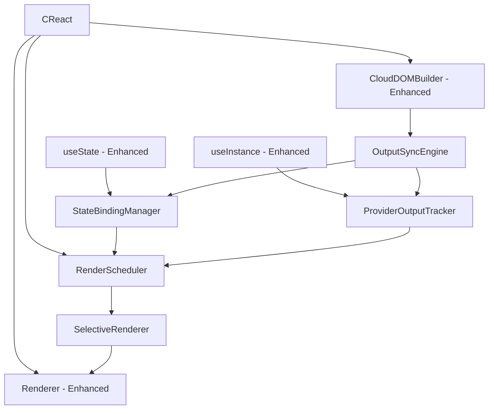

# Reactive Output System Design

## Overview

This design document outlines the specific changes needed to transform the current CReact implementation from a static build-deploy cycle into a reactive system where components re-render in response to provider outputs, state changes, and context updates. The design focuses on enhancing existing components rather than creating new ones.

## Current Architecture Analysis

### Existing Components That Need Enhancement

1. **CReact.ts** - Main orchestrator, needs re-render scheduling
2. **Renderer.ts** - JSX → Fiber transformation, needs selective re-rendering
3. **useState.ts** - Currently non-reactive, needs change detection
4. **useInstance.ts** - Resource creation, needs output binding
5. **CloudDOMBuilder.ts** - Fiber → CloudDOM, needs output sync
6. **types.ts** - Core types, needs reactive state tracking

### Current Flow (Non-Reactive)
```
JSX → Renderer → Fiber → CloudDOMBuilder → CloudDOM → Deploy → Outputs (stored)
```

### Target Flow (Reactive)
```
JSX → Renderer → Fiber → CloudDOMBuilder → CloudDOM → Deploy → Outputs → 
State Changes → Re-render Scheduler → Selective Re-render → Updated CloudDOM
```

## Architecture

### Enhanced Component Architecture



## Components and Interfaces

### 1. Enhanced CReact.ts

**Changes Needed:**
- Add `RenderScheduler` instance
- Add `rerender()` method for manual triggering
- Enhance `deploy()` to trigger output sync and re-renders
- Add batching for multiple state changes

**New Methods:**
```typescript
class CReact {
  private renderScheduler: RenderScheduler;
  
  // New method: Manual re-render trigger
  async rerender(stackName: string = 'default'): Promise<void>;
  
  // Enhanced method: Deploy with output sync
  async deploy(cloudDOM: CloudDOMNode[], stackName: string, user: string): Promise<void>;
  
  // New method: Schedule component re-render
  scheduleReRender(fiber: FiberNode, reason: ReRenderReason): void;
}
```

### 2. Enhanced Renderer.ts

**Changes Needed:**
- Add selective re-rendering capability
- Track component dependencies
- Support partial tree re-rendering

**New Methods:**
```typescript
class Renderer {
  // New method: Re-render specific components
  reRenderComponents(components: FiberNode[], reason: ReRenderReason): FiberNode;
  
  // New method: Find components that depend on changed state
  findDependentComponents(changedFiber: FiberNode): Set<FiberNode>;
  
  // Enhanced method: Track dependencies during render
  private executeComponent(type: any, props: Record<string, any>, path: string[]): any;
}
```

### 3. Enhanced useState.ts

**Changes Needed:**
- Add change detection in `setState`
- Trigger re-renders ONLY when bound to provider outputs
- Support output binding tracking

**Enhanced setState:**
```typescript
const setState = (value: T | ((prev: T) => T)): void => {
  const newValue = typeof value === 'function' ? 
    (value as (prev: T) => T)(fiber.hooks[hookIdx]) : value;
  
  const oldValue = fiber.hooks[hookIdx];
  
  // Only trigger re-render if value changed AND state is bound to output
  if (oldValue !== newValue) {
    fiber.hooks[hookIdx] = newValue;
    
    // Check if this state is bound to a provider output
    const stateBindingManager = getStateBindingManager(); // New utility
    const isOutputBound = stateBindingManager.isStateBoundToOutput(fiber, hookIdx);
    
    if (isOutputBound) {
      // Schedule re-render only for output-bound state
      const creactInstance = getCReactInstance(); // New utility
      creactInstance.scheduleReRender(fiber, 'state-change');
    }
  }
};
```

### 4. Enhanced useInstance.ts

**Changes Needed:**
- Track output bindings to state
- Detect output changes from providers
- Trigger re-renders when outputs change

**New Features:**
```typescript
export function useInstance<T = any>(
  construct: new (...args: any[]) => T,
  props: Record<string, any>
): CloudDOMNode {
  // ... existing code ...
  
  // New: Track this instance for output changes
  const providerOutputTracker = getProviderOutputTracker(); // New utility
  providerOutputTracker.trackInstance(node, currentFiber);
  
  return node;
}
```

### 5. Enhanced CloudDOMBuilder.ts

**Changes Needed:**
- Add output change detection
- Sync provider outputs to bound state
- Trigger re-renders for output changes

**New Methods:**
```typescript
class CloudDOMBuilder {
  // New method: Detect output changes after deployment
  detectOutputChanges(previous: CloudDOMNode[], current: CloudDOMNode[]): OutputChange[];
  
  // Enhanced method: Sync outputs and trigger re-renders
  async syncOutputsAndReRender(fiber: FiberNode, cloudDOM: CloudDOMNode[]): Promise<void>;
  
  // New method: Apply output changes to bound state
  applyOutputChangesToState(changes: OutputChange[]): Promise<void>;
}
```

### 6. New Supporting Classes

#### RenderScheduler
```typescript
class RenderScheduler {
  private pendingReRenders = new Set<FiberNode>();
  private batchTimeout: NodeJS.Timeout | null = null;
  private eventHooks?: CReactEvents;
  
  constructor(eventHooks?: CReactEvents) {
    this.eventHooks = eventHooks;
  }
  
  schedule(fiber: FiberNode, reason: ReRenderReason): void {
    this.pendingReRenders.add(fiber);
    this.scheduleBatch();
  }
  
  private scheduleBatch(): void {
    if (this.batchTimeout) return;
    
    this.batchTimeout = setTimeout(() => {
      this.flushBatch();
    }, 0); // Next tick batching
  }
  
  private async flushBatch(): Promise<void> {
    const fibers = Array.from(this.pendingReRenders);
    this.pendingReRenders.clear();
    this.batchTimeout = null;
    
    try {
      // Emit render start events
      fibers.forEach(fiber => this.eventHooks?.onRenderStart(fiber));
      
      // Execute selective re-render
      await this.executeReRenders(fibers);
      
      // Emit render complete events
      fibers.forEach(fiber => this.eventHooks?.onRenderComplete(fiber));
    } catch (error) {
      this.eventHooks?.onError(error as Error);
      throw error;
    }
  }
}
```

#### ProviderOutputTracker
```typescript
class ProviderOutputTracker {
  private instanceBindings = new Map<string, Set<FiberNode>>();
  private eventHooks?: CReactEvents;
  
  constructor(eventHooks?: CReactEvents) {
    this.eventHooks = eventHooks;
  }
  
  trackInstance(node: CloudDOMNode, fiber: FiberNode): void {
    if (!this.instanceBindings.has(node.id)) {
      this.instanceBindings.set(node.id, new Set());
    }
    this.instanceBindings.get(node.id)!.add(fiber);
  }
  
  getBindingsForInstance(nodeId: string): Set<FiberNode> {
    return this.instanceBindings.get(nodeId) || new Set();
  }
  
  notifyOutputChange(nodeId: string, outputKey: string, newValue: any): void {
    const boundFibers = this.getBindingsForInstance(nodeId);
    boundFibers.forEach(fiber => {
      try {
        // Notify about output change
        this.eventHooks?.onRenderStart(fiber);
      } catch (error) {
        this.eventHooks?.onError(error as Error, fiber);
      }
    });
  }
}
```

#### StateBindingManager
```typescript
class StateBindingManager {
  private stateBindings = new Map<FiberNode, Map<number, OutputBinding>>();
  
  bindStateToOutput(fiber: FiberNode, hookIndex: number, nodeId: string, outputKey: string): void {
    if (!this.stateBindings.has(fiber)) {
      this.stateBindings.set(fiber, new Map());
    }
    
    this.stateBindings.get(fiber)!.set(hookIndex, {
      nodeId,
      outputKey,
      lastValue: undefined,
      bindTime: Date.now()
    });
  }
  
  updateBoundState(nodeId: string, outputKey: string, newValue: any): FiberNode[] {
    const affectedFibers: FiberNode[] = [];
    
    for (const [fiber, bindings] of this.stateBindings) {
      for (const [hookIndex, binding] of bindings) {
        if (binding.nodeId === nodeId && binding.outputKey === outputKey) {
          if (binding.lastValue !== newValue) {
            // Update the state in the fiber
            if (fiber.hooks && fiber.hooks[hookIndex] !== newValue) {
              fiber.hooks[hookIndex] = newValue;
              binding.lastValue = newValue;
              affectedFibers.push(fiber);
            }
          }
        }
      }
    }
    
    return affectedFibers;
  }
}
```

### 7. Event Hooks System

**Optional Enhancement for Tooling:**
```typescript
interface CReactEvents {
  onRenderStart(fiber: FiberNode): void;
  onRenderComplete(fiber: FiberNode): void;
  onDeployStart(stack: string): void;
  onDeployComplete(stack: string): void;
  onError(error: Error, fiber?: FiberNode): void;
}
```

The RenderScheduler and ProviderOutputTracker can emit these events for visualization, metrics, and debugging tools.

## Data Models

### Enhanced Types

```typescript
// Enhanced FiberNode with reactive tracking
interface FiberNode {
  // ... existing properties ...
  
  // New: Reactive state tracking
  reactiveState?: {
    lastRenderReason?: ReRenderReason;
    lastRenderTime?: number;
    renderCount: number;
    isDirty: boolean;
  };
  
  // New: Dependency tracking
  dependencies?: Set<FiberNode>;
  dependents?: Set<FiberNode>;
}

// New: Re-render reasons (should be moved to types/reactivity.ts)
type ReRenderReason = 
  | 'state-change'
  | 'output-update' 
  | 'context-change'
  | 'structural-change'
  | 'hot-reload'
  | 'manual';

// New: Output binding
interface OutputBinding {
  nodeId: string;
  outputKey: string;
  lastValue: any;
  bindTime: number;
}

// New: Output change tracking
interface OutputChange {
  nodeId: string;
  outputKey: string;
  previousValue: any;
  newValue: any;
  affectedFibers: FiberNode[];
}

// New: Event hooks interface
interface CReactEvents {
  onRenderStart(fiber: FiberNode): void;
  onRenderComplete(fiber: FiberNode): void;
  onDeployStart(stack: string): void;
  onDeployComplete(stack: string): void;
  onError(error: Error, fiber?: FiberNode): void;
}
```

## Implementation Order

### Phase 1: Core Reactive Infrastructure
1. **Add RenderScheduler to CReact.ts**
   - Create RenderScheduler class
   - Add instance to CReact constructor
   - Add scheduleReRender method

2. **Enhance useState.ts with change detection**
   - Modify setState to detect changes
   - Add re-render triggering
   - Add utility to get CReact instance

3. **Add StateBindingManager**
   - Create state binding tracking
   - Add output binding methods
   - Integrate with useState

### Phase 2: Output Synchronization
1. **Enhance CloudDOMBuilder.ts**
   - Add output change detection
   - Add output sync methods
   - Integrate with post-deployment flow

2. **Enhance useInstance.ts**
   - Add ProviderOutputTracker integration
   - Track instance-to-fiber bindings
   - Add output change notifications

3. **Create ProviderOutputTracker class**
   - Track instance bindings
   - Detect output changes
   - Notify bound components

### Phase 3: Selective Re-rendering
1. **Enhance Renderer.ts**
   - Add selective re-rendering
   - Add dependency tracking
   - Add component filtering

2. **Integrate with CReact.ts deploy method**
   - Add output sync after deployment
   - Trigger re-renders for changed outputs
   - Handle batching and scheduling

### Phase 4: Context Reactivity
1. **Enhance useContext.ts**
   - Add context change detection
   - Track context dependencies
   - Trigger re-renders on context changes

2. **Enhance context providers**
   - Add value change detection
   - Notify consuming components
   - Handle context propagation

### Phase 5: Development Experience
1. **Add hot reload integration**
   - File change detection
   - Automatic re-rendering
   - State preservation

2. **Add debugging and monitoring**
   - Re-render tracing
   - Performance metrics
   - Error handling

## Error Handling

### Circular Dependency Detection
- Track re-render chains
- Detect infinite loops
- Break cycles with warnings

### Error Recovery
- Isolate failed re-renders
- Rollback state changes
- Continue with partial updates

### Performance Safeguards
- Limit re-render frequency
- Batch multiple changes
- Skip redundant updates
